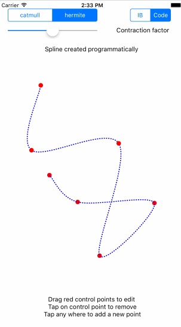

# Spline Editor
   Draw and edit a designable spline in swift. Create your spline in code or in Interface builder. Move, add and remove points while running. Based upon [UIBezierPath+LxThroughPointsBezier.swift](https://github.com/DeveloperLx/LxThroughPointsBezier-Swift) 
Installation
------------
  Only drag swift classes to your project.

Usage
-----------
###

        Interface builder

        -add a custom SplineView and use inspectable properties to edit
        -edit "points" properties to place spline control points   
        

        Programmatically

        var points = [CGPoint]()
        ...
        points.append(your points)
        ... 

        var frame = CGRect(...)

        let spline = SplineView(points: points, frame: frame)

        You need to give the spline a initial frame in order to correctly track touches.
        Points outside of this frame won't be added.  

        
DEMO
-----------
*      

License
-----------
Spline-Swift is available under the Apache License 2.0. See the LICENSE file for more info.

 

